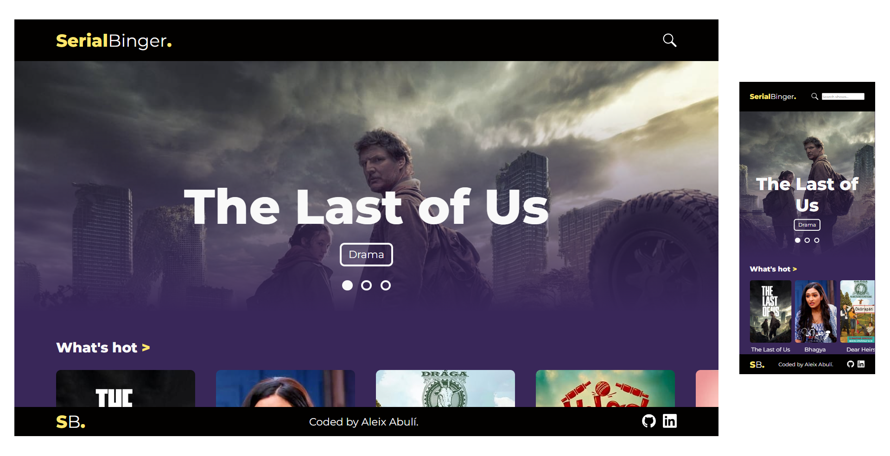
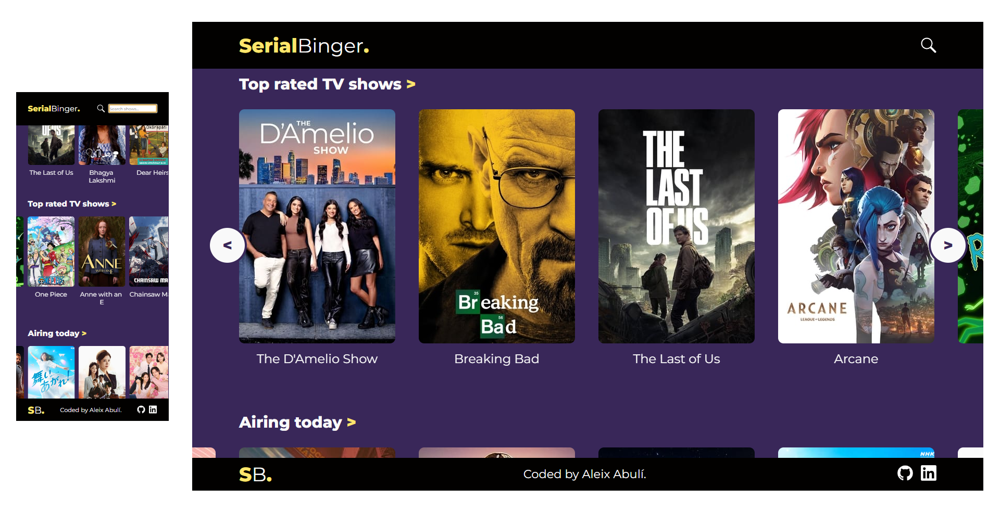
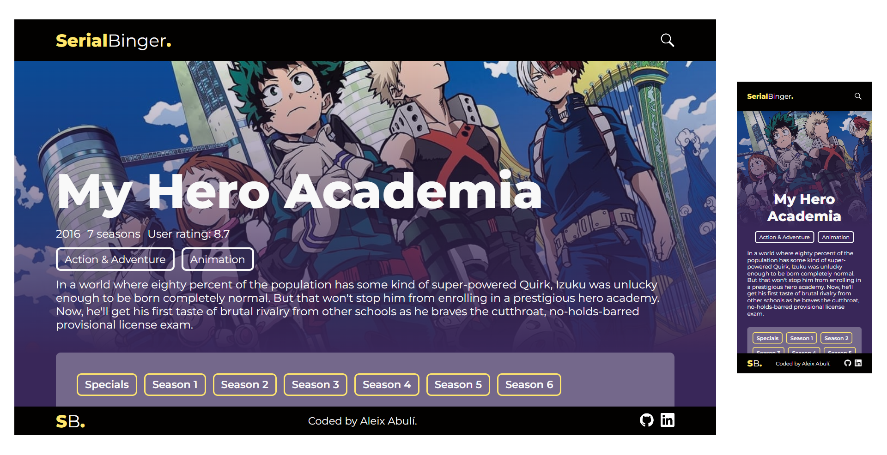

# Serial Binger

Serial Binger is a simple web application that allows users to browse and view details of TV shows.




## Features

- Users can view a homepage with different TV show recommendations
- Users can search TV shows through a search bar 
- Users can click on a TV show to view more details about it
- Details include show title, rating, overview, seasons and episodes

## Technologies Used

- Vue.js
- Vue Router
- Pinia
- Axios

## Getting Started

1. Clone the repository:

```npm
git clone https://github.com/aleix-abuli/vue-movies.git
```

2. Install dependencies:

```npm
cd vue-movies
npm install
```

3. Start the development server:

```npm
npm run dev
```

4. Navigate to `http://127.0.0.1:5173/` in your web browser to view the app.

## API

This app uses [The Movie Database API](https://developers.themoviedb.org/3/getting-started/introduction) to fetch data about TV shows. The following endpoints are used:

- `GET /tv/popular`: returns a list of popular TV shows
- `GET /tv/top_rated`: returns a list of the top ratedTV shows
- `GET /tv/airing_today`: returns a list of TV shows that are airing today
- `GET /tv/on_the_air`: returns a list of TV shows that are airing in the next 7 days
- `GET /genre/tv/list`: returns a list of TV genres
- `GET /search/tv`: returns a list of TV shows based on a specific query
- `GET /tv/:tv_id`: returns the details of a specific TV show
- `GET /tv/:tv_id/season/:season_number`: returns a list of the seasons a specific TV show has
- `GET /tv/:tv_id/similar`: returns a list of TV shows that are similar to a specific TV show
- `GET /tv/:tv_id/recommendations`: returns a list of TV show recommendations for a specific TV show

